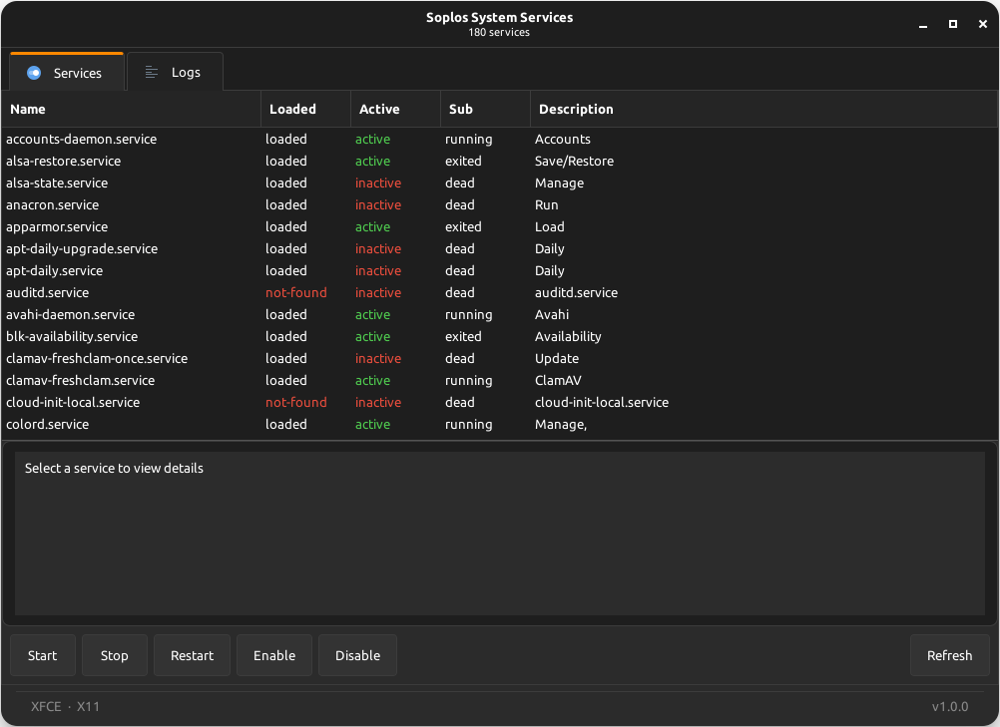
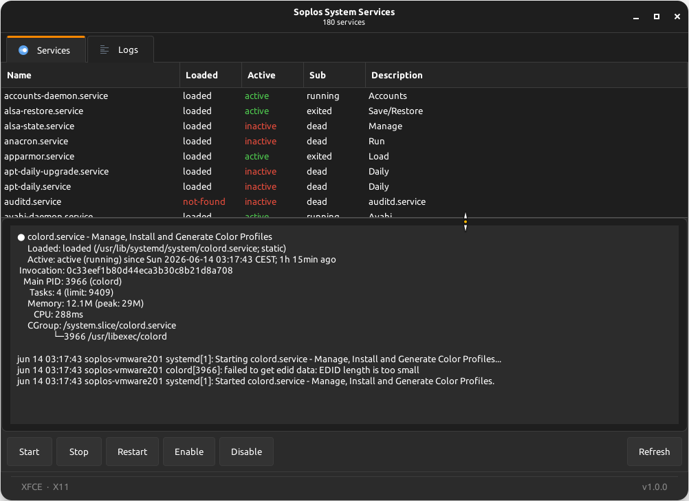
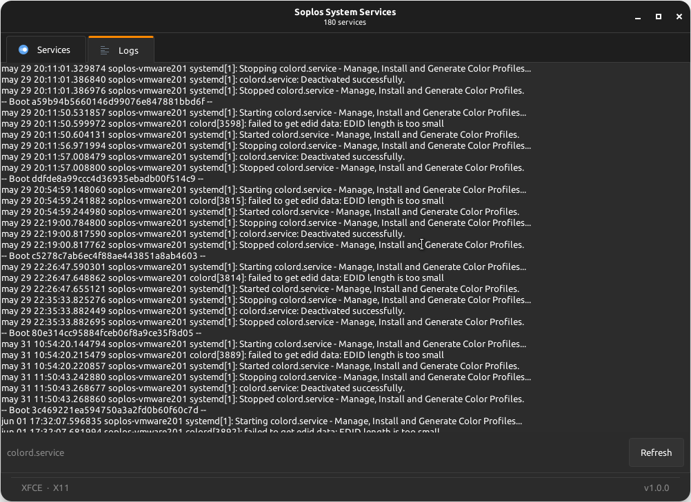

# Soplos System Services

[](https://www.gnu.org/licenses/gpl-3.0)
[]()

GTK3 graphical manager for systemd services on Soplos Linux.

*Gestor grafico GTK3 para servicios systemd en Soplos Linux.*

*Gestionnaire graphique GTK3 pour les services systemd sous Soplos Linux.*

*GTK3-Verwaltungsoberflache fur systemd-Dienste unter Soplos Linux.*

*Gestore grafico GTK3 per i servizi systemd su Soplos Linux.*

*Gestor grafico GTK3 para servicos systemd no Soplos Linux.*

*Manager grafic GTK3 pentru serviciile systemd pe Soplos Linux.*

*Графический менеджер GTK3 для служб systemd в Soplos Linux.*

## Description

Soplos System Services is a graphical tool for managing systemd services on Soplos Linux Boro, Tyron and Tyson. It provides a clean tabbed interface to view, control and monitor all system services without using the terminal. Supports all major desktop environments and display protocols with complete internationalization for 8 languages.

## Screenshots





## Features

- **Tab navigation**: Two-tab interface (Services / Logs) using Gtk.Notebook with Soplos orange accent on active tab
- **Service list**: Complete view of all systemd services with name, load state, active state, sub-state and description, color-coded (green for active, red for failed/inactive/not-found)
- **Service control**: Start, stop, restart, enable and disable services with confirmation dialogs; buttons adapt to service state (Start disabled when already running, Stop disabled when already stopped)
- **Service details**: Scrollable details panel showing the full systemctl status output for the selected service
- **Log viewer**: Real-time journalctl log output for the selected service in the Logs tab
- **Progress bar**: Gtk.Revealer with pulse animation shown during loading and service operations, with 700ms minimum display time; positioned between content and footer
- **CSD header bar**: Always active with Soplos decoration layout, subtitle updated with operation status
- **Soplos footer**: Static DE and display protocol on the left, version on the right
- **Theme detection**: Automatic dark/light theme detection per desktop environment; theme is pre-detected as the regular user before pkexec elevation to ensure correct colors as root
- **CSS theming**: Consistent Soplos visual style via two separate GTK3 CSS providers (dark.css or light.css plus base.css), following the Soplos theme pattern
- **8-language interface**: Spanish, English, French, German, Italian, Portuguese, Romanian, Russian
- **Privilege elevation**: Transparent root access via pkexec with all required environment variables forwarded
- **Background threading**: Service listing and log fetching run in background threads with GLib.idle_add callbacks
- **pycache cleanup**: Automatic cleanup of __pycache__ on exit via atexit and SIGINT/SIGTERM handlers

## Installation

```bash
sudo apt install soplos-system-services
```

## Supported Languages

- Spanish (Espanol)
- English
- French (Francais)
- German (Deutsch)
- Italian (Italiano)
- Portuguese (Portugues)
- Romanian (Romana)
- Russian (Russkiy)

To force a specific language:

```bash
SOPLOS_SYSTEM_SERVICE_LANG=en /usr/bin/python3 main.py
```

## Requirements

- Python 3.7 or later
- PyGObject (python3-gi)
- GTK 3.0 (gir1.2-gtk-3.0)
- systemd
- pkexec (PolicyKit)

## License

This project is licensed under [GPL-3.0+](https://www.gnu.org/licenses/gpl-3.0.html) (GNU General Public License version 3 or later).

Any derivative work must be distributed under the same license (GPL-3.0+).

For more details, see the LICENSE file or visit [gnu.org/licenses/gpl-3.0](https://www.gnu.org/licenses/gpl-3.0.html).

## Developer

Developed by Sergi Perich
Website: https://soplos.org
Contact: info@soploslinux.com

## Links

- [Website](https://soplos.org)
- [Report issues](https://github.com/SoplosLinux/soplos-system-service/issues)

## Versions

### v1.0.0-2 (14/06/2026)

- pkexec handling moved entirely to the bash wrapper; removed from main.py
- Wrapper renamed to match project name (soplos-system-service, no trailing s)
- Wrapper follows the Soplos pattern: pkexec calls python3 -c inline, no recursive wrapper invocation
- GLib.set_prgname and GLib.set_application_name set in wrapper before importing main, eliminating duplicate call warning
- Gtk.Application flag changed to HANDLES_COMMAND_LINE with do_command_line calling activate(); fixes silent exit when running as root via pkexec
- postinst simplified: removed broken chmod with wrong path that caused package install failure
- Dark/light theme detection in the bash wrapper (xfconf-query / gsettings)
- Progress bar position fixed: now appears above the footer
- Progress bar minimum display time of 700ms
- Details panel: Gtk.Label replaced by Gtk.TextView inside Gtk.ScrolledWindow
- Smart action buttons: Start/Stop/Restart adapt to current service state
- Color-coded Loaded column: not-found in red
- Black border artifact removed from details panel
- Suppressed ibus warnings when running as root via GTK_IM_MODULE

### v1.0.0-1 (14/06/2026)

Complete rewrite of the application:

- Gtk.Notebook tab interface (Services / Logs) replacing the original skeleton
- Services tab: sortable TreeView with color-coded active state (green/red) and color-coded load state (not-found in red)
- Smart action buttons: Start/Stop/Restart enabled or disabled based on current service state
- Scrollable details panel using Gtk.TextView inside Gtk.ScrolledWindow
- Logs tab: Gtk.TextView with monospace font showing journalctl output for the selected service
- Progress bar: Gtk.Revealer with pulse animation during loading and service operations
- CSD HeaderBar always active; subtitle shows operation status while loading
- Static Soplos footer: DE and protocol on the left, base version (no debian revision) on the right
- Dark/light theme pre-detected as the regular user before pkexec and passed via SOPLOS_COLOR_SCHEME environment variable, ensuring correct theme as root
- Two-provider CSS loading pattern (dark.css or light.css first, then base.css) following the Soplos theme pattern
- All text through the i18n system, no hardcoded strings
- pycache cleanup via atexit.register and signal handlers for SIGINT/SIGTERM
- Polkit policy file, .desktop file with 8-language Name/Comment, Debian control/copyright
- Icons: 48x48, 64x64, 128x128 from original 1024px icon
- 3 screenshots added to assets/screenshots

### v1.0.0 (31/07/2025)

- Initial project creation with base GTK3 structure
- systemd service listing via systemctl
- Basic service control functions (start, stop, restart, enable, disable)
- 8-language string system (es, en, fr, pt, de, it, ro, ru)
